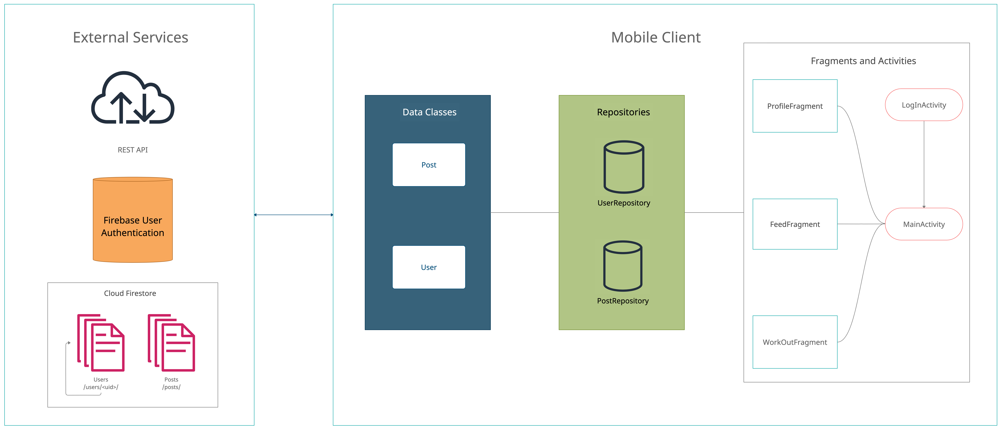
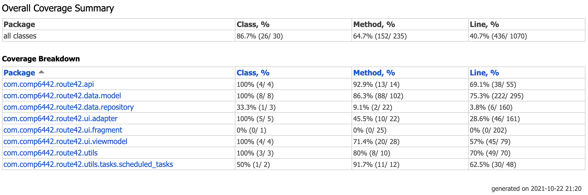

# Route 42 Design Document

## Table of Contents

[toc]

## Team

### Team Members and Roles

| UID | Name | Role |
| :--- | :----: | ---: |
| u7233149 | Kai Hirota | Full-Stack |
| u7269158 | John (Min Jae) Kim | Data Structure, Feature Testing |
| u7234659 | Honggic Oh | Search, Feature Testing |
| u7199021| Theo Darmawan | Full-Stack |

### Meeting minutes

- [Meeting 1 - 31st August](https://gitlab.cecs.anu.edu.au/u7233149/software-construction-group-project/-/blob/report/docs/meetings/aug31.md)
- [Meeting 2 - 7th September](https://gitlab.cecs.anu.edu.au/u7233149/software-construction-group-project/-/blob/report/docs/meetings/sep7.md)
- [Meeting 3 - 8th October](https://gitlab.cecs.anu.edu.au/u7233149/software-construction-group-project/-/blob/report/docs/meetings/oct8.md)

### Conflict Resolution Protocol

- Conflicts will be resolved through civil discussion and democratic voting process involving all
  parties interested in the matter.
    - For example, if someone wants to change the direction or the concept of the app, everyone must
      be involved in the decision-making. If someone wants to change a small class in the project,
      then that can be done either through voting, or by mutual agreement upon directly discussing
      with the person who created the class.

- Task assignments: Trello Kanban board

  

## Application Description

**Targets Users: Workout Enthusiasts**

Route42 is a social networking app for athletes of various levels. With Route42, users can:

1. Record workouts, including walking, running, and cycling.
2. Track performance metrics and see the recorded workouts in an interactive map.
3. Follow other users, and view and like other people's workouts.
4. Search for posts by username, hashtags, and proximity to the user's location


Image: Feed, Activity logging, Profile, Route, and Nearest Neighbor Search screens (Left to Right)

### Use Case Example

1. Athletic Activity Tracking and Sharing
    1. Michael runs at ANU running club, and wants to record and share his daily runs.
    2. Once ready, he starts the `run` activity on the app
    3. The app tracks Michael's location and route, and display it on a map. Performance metrics are
       displayed in real time.
    4. After finishing his run, Michael ends the `run` activity on the app.
    5. The app will display a post template for sharing the completed activity.
    6. Michael may write a description and add hashtags like `#ANUrunning` before sharing it. The
       app will extract the hashtags and tag the post for you.
    7. The created post can immediately be viewed by other users on their feeds.
    8. Michael can also select his past posts or posts created by others and see an interactive map
       of the route associated with the post.
2. Social networking and searching
    1. Emily is an avid runner who recently started competing in marathons. Emily wants to connect
       with other aspiring athletes.
    2. Emily can search for posts on Route42 app by username and hashtags, and look at other
       athletes and their workouts and routes.
    3. Emily can also search for posts by geographical proximity, and the app will visualize the
       places where others logged their workouts on an interactive map.

#### Scheduled Actions

If the user does not have an active internet connection, the app allows scheduling of posts and
likes. To schedule a post, the user checks the `schedule` button and selects the time delay. To
schedule a like, the user long-clicks the like button and selects the time delay.

#### Pausing a workout

If the user needs to pause the workout, they can manually do so. Otherwise, navigating away from
the `Activity` screen will automatically pause it for them.

## Diagrams

### Architecture



[Link](https://app.creately.com/diagram/K2ScahytOcK)

### Mobile App


[Link](https://lucid.app/lucidchart/d393dc76-9233-4176-90cd-def360405cbf/edit?invitationId=inv_ca06d23e-a397-4482-a2fc-3623c77f8ec2)

### REST API


[Link](https://lucid.app/lucidchart/7f02648c-8f14-4af9-95ab-6c9379064044/edit?invitationId=inv_8e28283d-2136-4e55-8941-7e763d5021cf)

## Design Decisions

### **Data Structures**

- KD Tree
    - Where: REST API `GET /search/knn` with `k`, `lon`, `lat` parameters.
    - Why: KD Tree (K-dimensional tree) is used to store and search 2-D data of location (longitude,
      latitude). KD tree is useful for finding nearest neighbors and performing range search based
      on multiple dimensions of data - such as longitude and latitude.
- HashMap
    - Where: Used by the REST API for union and intersection operations between lists of `Post`s.
    - Why: It's the most efficient way of finding set union and intersections. This is used to chain
      the left and right results when executing commands in `QuerySyntaxTree`.
- Binary Tree
    - Where:
        - REST API `POST /search/` endpoint uses `QuerySyntaxTree` to process the query text sent by
          a client.
        - `QueryTreeNode` is used to extract the hierarchical structure of nodes, each representing
          a binary operator and two expressions.
    - Why:
        - It allows efficient parsing of tokens, and allows us to express various operations in a
          recursive manner, making the code easy to read and maintain.

### **Design Patterns**

- Singleton & Repository

    - Where: `UserRepository` and `PostRepository` classes under `repository` submodule.
    - Why:
        - Singleton pattern prevents unnecessary creation of multiple instances of connections with
          the database. By using singleton, the program uses less memory, and managing the
          connection with the database is easier.
        - Repository pattern abstracts the database operations and allows decoupling of the database
          access logic from the application logic.

- Single-activity architecture

    - 

      [Source](https://oozou.com/rails/active_storage/blobs/eyJfcmFpbHMiOnsibWVzc2FnZSI6IkJBaHBBcVVvIiwiZXhwIjpudWxsLCJwdXIiOiJibG9iX2lkIn19--c8573fcc38b58509d10a83145f6b519d306ed039/1*VSXfNBCsxa3_wCOAqR88aQ.png)

    - What: Composition of Android application based on single or a couple activities, each managing
      one or more fragments.

    - Where: Entire application.

    - Why:
        - Route42 primarily has one activity called `MainActivity` which contains a fragment
          container view, which swaps between fragments based on user interactions.
        - Usage of this architecture reduces lines of code required for the whole app, while making
          it easier to prototype new features.

- REST API

    - Where: In the cloud (AWS EC2 instance)
    - Why:
        - When using Cloud Firestore Android SDK, we have some limitations.
            - Cannot perform partial text search - for example, we cannot query on substring of a
              text field.
            - Cannot use more than one `arrayContains` in a single query.
            - No support for boolean OR operation between multiple filters.
            - Every CRUD operation must be asynchronous in order to not freeze up the UI thread.
        - Using the REST API allows us to use the Firebase-admin SDK, which gives the REST API
          higher privilege and more capability than the mobile client.
        - Using REST API allows us to simplify database reads and writes. The downside is that we
          sacrifice Firestore's document listener feature, where we can listen to updates on
          documents of interest.

- ViewModel
    - What: An intermediate observable class which enables data to persist independent of fragment
      lifecycle and attaching listeners to data changes.
    - Where: `ActiveMapViewModel` and `UserViewModel`
    - Why: By storing data in a view model class, data is not deleted when views are destroyed (e.g.
      when the user navigates to another page, or when the phone is rotated). Also, by listening to
      changes to `LiveData` members of the view model, views can update directly to changes in
      persistent data stored in Firebase, through listening to the `LiveData` class. This improves
      separation of UI layer from the data layer, as the UI is not dependent on any repository
      classes.

- Multi-threading / background execution

    - Where: `PhotoMapFragment`, `ScheduleablePost` , `SchedulableLike`
    - Why: When making the REST API call to `search/knn`, the communication is handled by a
      background worker thread. This ensures the UI thread (the main thread) does not freeze and
      remains responsive. Scheduled actions involving IO operations and network calls are also
      handled in the background to minimize load on the UI thread.

### **Grammars**

- `<Term>      ::=    <Expr> | <Term> + <Term> | <Term> + <Operator>`
- `<Expr>      ::= <Keyword> | <bracket>`
- `<Operator>  ::=     <and> | <or>`

Advantage

- Parser Tree is a binary tree as opposed to being a n-ary tree, making it easier to construct the
  Parser Tree.

Disadvantage

- When multiple AND / OR operations are used in the query (
  i.e. `"hashtag: #running AND hashtag: #jogging"`), Parser Tree does not make optimizations. While
  Firestore supports `.arrayContains()` operation, our Parser Tree represent each `AND/OR` as a
  single node. In other words, `"hashtag: #running AND hashtag: #jogging"` could be represented as a
  single node in an n-ary tree, but

### **Tokenizer and Parsers**

- Every token either contains an operator and two expressions, or a key and value.
- Tokens are extracted by prioritizing parenthesis, and then extracting from left to right.
- For example, if a query consists of 10 hashtags chained by OR, then the
  resulting `QuerySyntaxTree` will be equivalent to a linked list, where each node only has a right
  child.

Examples

```
1. "test test2" -> {hashtags: ["test", "test2"]} -> 
Node(
	Node(null, "hashtags:test", null), 
	OR, 
	Node(null, "hashtags:test2", null)
)

2. "username: xxx AND hashtags: #hashtag1 #android #app" ->
{OR: [
    {userName: "xxx"}, 
    {hashtags: ["#hashtag1", "#android", "#app"]}
  ]
}
Node(
	Node(null, "username:xxx", null), 
	AND, 
	Node(
		Node(
			null, 
			"hashtags: #hashtag1", 
			null
		), 
		OR, ,
		Node(
			Node(null, "hashtags: #android", null), 
			OR, 
			Node(null, "hashtags: #app", null)
		)
	)
)
```

## Summary of Known Errors and Bugs

*[Where are the known errors and bugs? What consequences might they lead to?]*

1. Search functionality can handle partially valid and invalid search queries. (medium)

1. *Bug 1:*

- *A space bar (' ') in the sign in email will crash the application.*
- ...

2. *Bug 2:*
3. ...

*List all the known errors and bugs here. If we find bugs/errors that your team do not know of, it
shows that your testing is not through.*

## Testing Summary

[Coverage Summary](coverage/index.html)



## Implemented Features

- Easy: 6
- Medium: 5
- Hard: 1
- Very Hard: 1

Improved Search

1. Search functionality can handle partially valid and invalid search queries. (medium)

UI Design and Testing

1. UI tests using espresso or similar. Please note that your tests must be of reasonable quality. (
   For UI testing, you may use something such as espresso) (hard)

Greater Data Usage, Handling and Sophistication

1. Read data instances from multiple local files in different formats (JSON, XML or Bespoken). (
   easy)
2. User profile activity containing a media file (image, animation (e.g. gif), video). (easy)
3. Use GPS information. (easy)

User Interactivity

1. The ability to micro-interact with 'posts' (e.g. like, report, etc.) [stored in-memory]. (easy)
2. The ability for users to ‘follow’ other users. There must be an adjustment to either the user’s
   timeline in relation to their following users or a section specifically dedicated to posts by
   followed users. [stored in-memory] (medium)
5. Scheduled actions. At least two different types of actions must be schedulable. For example, a
   user can schedule a post, a like, a follow, a comment, etc. (medium)

User Privacy

1. Privacy II: A user can only see a profile that is Public (consider that there are at least two
   types of profiles: public and private). (easy)

Peer to Peer Messaging

1. Privacy I: provide users with the ability to ‘block’ users. Preventing them from directly
   messaging them. (medium)

Firebase Integration

1. Use Firebase to implement user Authentication/Authorisation. (easy)
2. Use Firebase to persist all data used in your app (this item replace the requirement to retrieve
   data from a local file) (medium)
3. Using Firebase or another remote database to store user posts and having a user’s timeline update
   as the remote database is updated without restarting the application. E.g. User A makes a post,
   user B on a separate instance of the application sees user A’s post appear on their timeline
   without restarting their application. (very hard)

# Appendix

## Third-party libraries used

### Android App

```
implementation 'androidx.annotation:annotation:1.2.0'
implementation 'androidx.activity:activity:1.2.0'
implementation 'androidx.fragment:fragment:1.3.0'
implementation 'androidx.appcompat:appcompat:1.3.1'
implementation 'androidx.constraintlayout:constraintlayout:2.1.0'
implementation "androidx.lifecycle:lifecycle-common-java8:2.3.1"
implementation 'androidx.lifecycle:lifecycle-livedata-ktx:2.3.1'
implementation 'androidx.lifecycle:lifecycle-viewmodel-ktx:2.3.1'
implementation 'androidx.multidex:multidex:2.0.1'
implementation 'androidx.legacy:legacy-support-v4:1.0.0'
implementation "androidx.work:work-runtime:2.7.0"

// ------ utils ------
implementation 'com.google.code.gson:gson:2.8.8'
implementation 'com.google.android.material:material:1.4.0'
implementation 'com.jakewharton.timber:timber:5.0.1'

// ------ Navigation Component ------
def nav_version = "2.3.5"
androidTestImplementation "androidx.navigation:navigation-testing:$nav_version"
implementation "androidx.navigation:navigation-compose:2.4.0-alpha08"
implementation "androidx.navigation:navigation-dynamic-features-fragment:$nav_version"
implementation "androidx.navigation:navigation-fragment:$nav_version"
implementation "androidx.navigation:navigation-ui:$nav_version"

// ----------- Glide ----------------
implementation 'com.github.bumptech.glide:glide:4.12.0'
annotationProcessor 'com.github.bumptech.glide:compiler:4.12.0'

// ----------- Google Maps ----------
implementation 'com.google.android.gms:play-services-location:18.0.0'
implementation 'com.google.android.gms:play-services-maps:17.0.1'

// ----------- REST API ------------
implementation 'com.squareup.retrofit2:retrofit:2.8.0'
implementation 'com.squareup.retrofit2:converter-gson:2.8.0'
implementation 'com.squareup.okhttp3:logging-interceptor:3.12.7'

// ----------- Firebase ------------
implementation platform('com.google.firebase:firebase-bom:28.4.0')
implementation 'com.google.firebase:firebase-analytics'
implementation 'com.google.firebase:firebase-auth'
implementation 'com.google.firebase:firebase-firestore:23.0.3'
implementation 'com.firebaseui:firebase-ui-firestore:6.2.1'
implementation 'com.google.firebase:firebase-storage'
implementation 'com.firebaseui:firebase-ui-storage:7.2.0'
implementation 'com.firebase:geofire-android-common:3.1.0'

// ----------- Tests ---------------
testImplementation 'junit:junit:4.+'
androidTestImplementation 'androidx.test.ext:junit:1.1.3'
androidTestImplementation 'androidx.test.espresso:espresso-core:3.4.0'
androidTestImplementation 'androidx.test.espresso:espresso-intents:3.4.0'
androidTestImplementation 'androidx.test:runner:1.4.0'
androidTestImplementation 'androidx.test:rules:1.4.0'
implementation "androidx.profileinstaller:profileinstaller:1.1.0-alpha04"```
```

### REST API

```
implementation 'com.google.firebase:firebase-admin:8.1.0'
implementation 'org.springframework.boot:spring-boot-starter-web:2.5.5'
implementation 'org.springframework.cloud:spring-cloud-gcp-starter-firestore:1.2.8.RELEASE'
developmentOnly 'org.springframework.boot:spring-boot-devtools:2.5.5'
```

